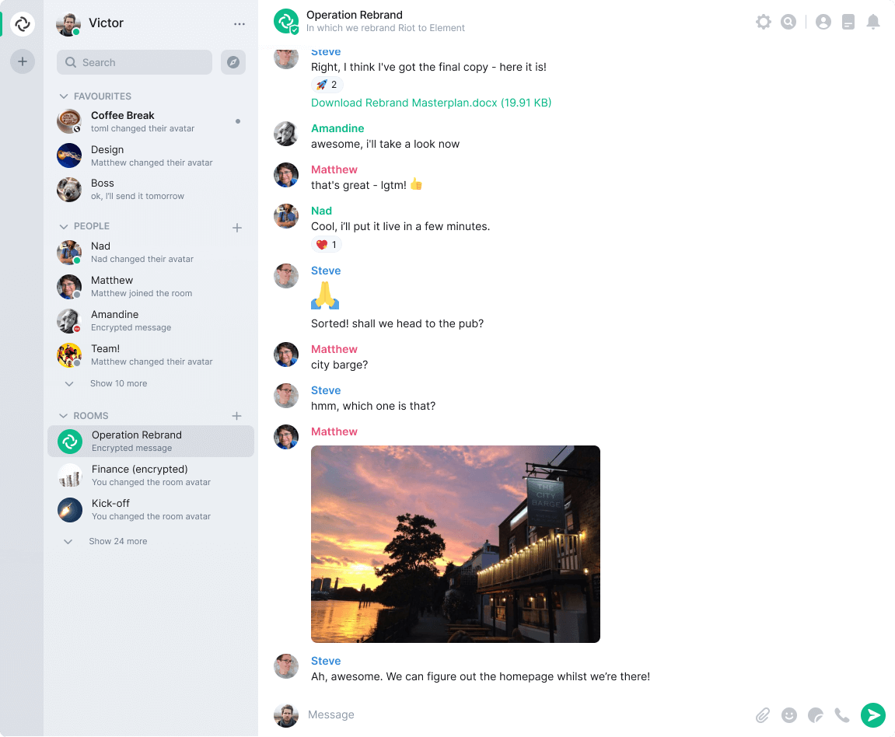

<!--
N.B.: This README was automatically generated by https://github.com/YunoHost/apps/tree/master/tools/README-generator
It shall NOT be edited by hand.
-->

# Element pour YunoHost

[](https://dash.yunohost.org/appci/app/element)    
[](https://install-app.yunohost.org/?app=element)

*[Read this readme in english.](./README.md)*

> *Ce package vous permet d'installer Element rapidement et simplement sur un serveur YunoHost.
Si vous n'avez pas YunoHost, regardez [ici](https://yunohost.org/#/install) pour savoir comment l'installer et en profiter.*

## Vue d'ensemble

Element est un nouveau type d'application de messagerie. Vous choisissez où vos messages sont stockés, ce qui vous donne le contrôle de vos données. Il vous donne accès au réseau ouvert Matrix, vous pouvez donc parler à n'importe qui. Element offre un nouveau niveau de sécurité, en ajoutant la vérification des appareils par signature croisée au chiffrement de bout en bout par défaut. 

**Version incluse :** 1.11.4~ynh1


**Démo :** https://app.element.io/

## Captures d'écran



## Avertissements / informations importantes

## Fonctionnalités spécifiques à YunoHost

### Prise en charge multi-utilisateurs

Cette application prend en charge le SSO. Si vous souhaitez utiliser le SSO, vous devez définir le chemin d'accès au serveur domestique par défaut car votre serveur domestique est installé sur votre instance YunoHost.

## Informations supplémentaires

### Note de sécurité importante

Nous vous déconseillons d'exécuter Element à partir du même nom de domaine que votre Matrix
serveur domestique (Synapse). La raison en est le risque de XSS (cross-site-scripting)
vulnérabilités qui pourraient survenir si quelqu'un provoquait le chargement et le rendu d'Element
un utilisateur malveillant a généré du contenu à partir d'une API Matrix qui avait alors fait confiance
accès à Element (ou à d'autres applications) en raison du partage du même domaine.

Nous avons mis en place des mesures d'atténuation grossières pour essayer de nous protéger contre ce
situation, mais ce n'est toujours pas une bonne pratique de le faire en premier lieu. Voir
https://github.com/vector-im/riot-web/issues/1977 pour plus de détails.

## Documentations et ressources

* Site officiel de l'app : <https://element.io>
* Documentation officielle de l'admin : <https://element.io/help>
* Dépôt de code officiel de l'app : <https://github.com/vector-im/element-web/>
* Documentation YunoHost pour cette app : <https://yunohost.org/app_element>
* Signaler un bug : <https://github.com/YunoHost-Apps/element_ynh/issues>

## Informations pour les développeurs

Merci de faire vos pull request sur la [branche testing](https://github.com/YunoHost-Apps/element_ynh/tree/testing).

Pour essayer la branche testing, procédez comme suit.

``` bash
sudo yunohost app install https://github.com/YunoHost-Apps/element_ynh/tree/testing --debug
ou
sudo yunohost app upgrade element -u https://github.com/YunoHost-Apps/element_ynh/tree/testing --debug
```

**Plus d'infos sur le packaging d'applications :** <https://yunohost.org/packaging_apps>
